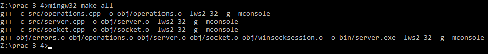
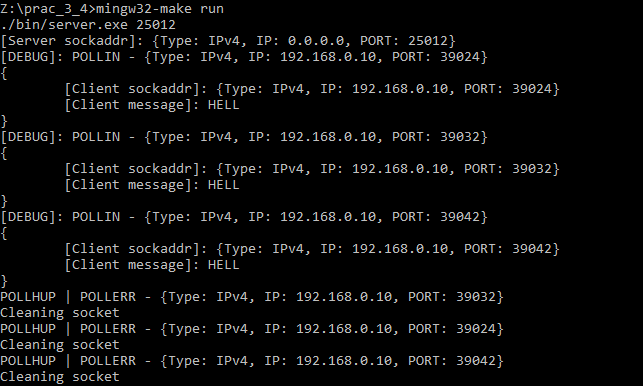

`makefile`-s parameters:
- all (creating whole project)
- debug (preparing all binary files and running gdb)
- clean (cleaning `obj` and `binary` directories if they exist)
- run (running `$(EXE)` binary using `25012`, as the default port)

Example of building:
 
Example of server's output:
